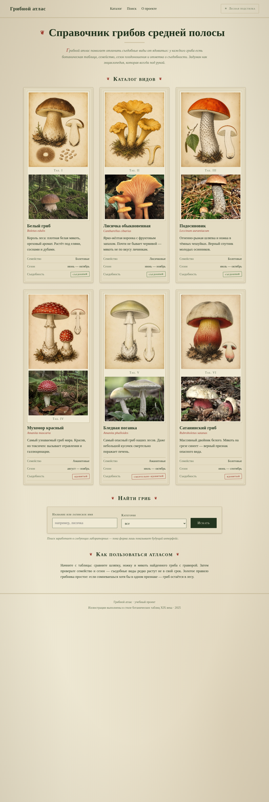
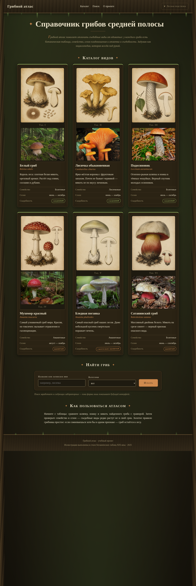

# Грибной атлас

Справочник грибов средней полосы в стиле винтажного ботанического атласа.
Лабораторная работа № 1: статическая клиентская часть веб-приложения.

Форк задания: [xDesh4ka/hello-web-lr-1](https://github.com/xDesh4ka/hello-web-lr-1)

## Для кого

Для начинающих грибников и всех, кто хочет научиться отличать
съедобные грибы от ядовитых по внешним признакам.

## Скриншоты

| Светлая тема «Ботанический атлас» | Тёмная тема «Лесная подстилка» |
|---|---|
|  |  |

## Что на странице

- Шапка с названием и навигацией по разделам.
- Заголовок и краткое описание задачи проекта.
- Каталог из шести карточек: у каждой — ботаническая таблица, фотография,
  название, латинское имя, описание и свойства (семейство, сезон, съедобность).
- Форма поиска: текстовое поле и выбор категории.
- Блок «Как пользоваться атласом».
- Подвал.

## Особенности

- Две темы оформления, переключаемые чистым CSS (чекбокс + `:has()`, без JavaScript).
- Светлая — «ботанический атлас»: состаренная бумага, гравюры, печати.
- Тёмная — «лесная подстилка»: мох, кора, тёмная земля.
- Сетка карточек на CSS Grid, навигация и свойства — на Flexbox.
- Адаптивность: 360 px (1 колонка), 768 px (2), 1280 px (3).

## Как открыть

Откройте `index.html` в браузере — стили подключаются из `styles/main.css`,
изображения лежат в `assets/images/`.

## Структура проекта

```text
hello-web-lr-1/
├── index.html
├── styles/
│   └── main.css
├── assets/
│   └── images/         # иллюстрации и фото видов
├── screenshot-light.png
├── screenshot-dark.png
└── README.md
```

## Иллюстрации

Гравюры-таблицы сгенерированы нейросетью в стиле ботанических таблиц XIX века.
Полевые фотографии лисички, подосиновика, бледной поганки и сатанинского гриба —
из датасета автора проекта; фото белого гриба и мухомора пока сгенерированы.
